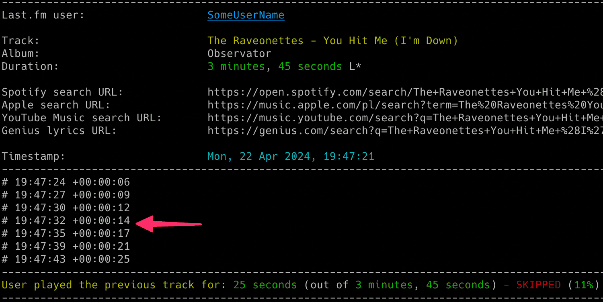
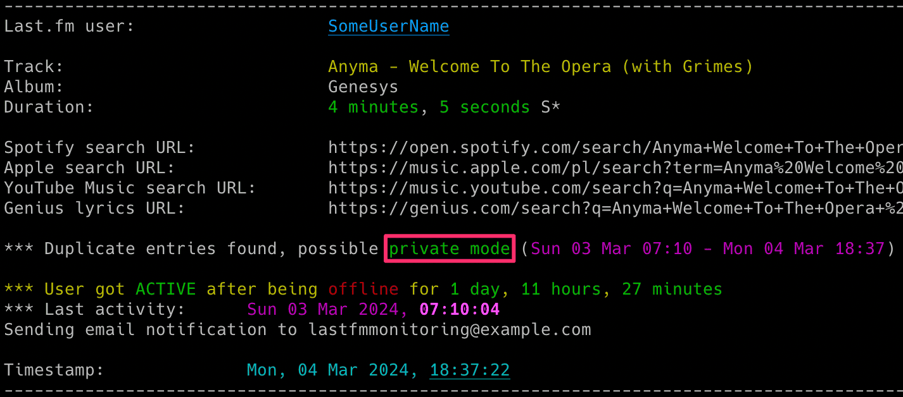

# lastfm_monitor

lastfm_monitor is a tool that allows for real-time monitoring of Last.fm users' music activity.

## Features

- Real-time tracking of songs listened by Last.fm users (including detection of when a user gets online or offline)
- Possibility to automatically play songs listened by the tracked user in your local Spotify client
- Information about when a user pauses or resumes playback with the option to show a track progress indicator
- Information about how long the user listened to a song, whether it was shorter or longer than the track duration and if the song was skipped
- Email notifications for various events (user becomes active or inactive, specific or all songs, songs on loop, new entries appearing while user was offline, errors)
- Saving all listened songs with timestamps to the CSV file
- Clickable Spotify, Apple Music, YouTube Music and Genius Lyrics search URLs printed in the console & included in email notifications
- Displaying basic statistics for the user's playing session (duration, time span, number of listened and skipped songs, songs on loop, paused playback time and number of pauses)
- Support for detecting offline mode
- Support for detecting Spotify's private mode (not 100% accurate)
- Ability to control the running copy of the script via signals

<p align="center">
   
</p>

## Change Log

Release notes can be found [here](RELEASE_NOTES.md)

## Requirements

The tool requires Python 3.9 or higher.

It uses [pyLast](https://github.com/pylast/pylast) library, also requires requests, python-dateutil and urllib3.

Optionally, you might want to install [Spotipy](https://github.com/spotipy-dev/spotipy), but it is required only for Spotify-related features.

It has been tested successfully on:
- macOS (Ventura, Sonoma & Sequoia)
- Linux:
   - Raspberry Pi OS (Bullseye & Bookworm)
   - Ubuntu 24
   - Rocky Linux (8.x, 9.x)
   - Kali Linux (2024, 2025)
- Windows (10 & 11)

It should work on other versions of macOS, Linux, Unix and Windows as well.

## Installation

Install the required Python packages:

```sh
python3 -m pip install requests python-dateutil urllib3 pylast
```

If you also want to use Spotify-related features, please install Spotipy:

```sh
python3 -m pip install spotipy
```

Or everything from requirements.txt:

```sh
pip3 install -r requirements.txt
```

Copy the *[lastfm_monitor.py](lastfm_monitor.py)* file to the desired location. 

You might want to add executable rights if on Linux/Unix/macOS:

```sh
chmod a+x lastfm_monitor.py
```

## Configuration

Edit the *[lastfm_monitor.py](lastfm_monitor.py)* file and change any desired configuration variables in the marked **CONFIGURATION SECTION** (all parameters have detailed description in the comments).

### Last.fm 'API key' and 'Shared secret'

Mandatory activity is to create your Last.fm **API key** and **Shared secret** by going to [https://www.last.fm/api/account/create](https://www.last.fm/api/account/create) (or get your existing one from [https://www.last.fm/api/accounts](https://www.last.fm/api/accounts))

Then change `LASTFM_API_KEY` and `LASTFM_API_SECRET` variables to respective values (or use **-u** and **-w** parameters).

### User privacy settings

In order to monitor Last.fm user activity, proper privacy settings need to be enabled on the monitored user account, i.e. in Last.fm *'Settings'* -> *'Privacy'* the *'Hide recent listening information'* setting should be disabled. Otherwise you will get this error message returned by the pyLast library: *'Login: User required to be logged in'*.

### Spotify client ID and secret (optional)

If you want to obtain the [track duration from Spotify](#getting-track-duration-from-spotify) (**-r** parameter) or use the [track_songs functionality](#automatic-playback-of-tracks-listened-to-by-the-user-in-the-spotify-client) (**-g** parameter) so the tool automatically plays the track listened by the user in your Spotify client, then you need to log in to Spotify Developer dashboard ([https://developer.spotify.com/dashboard](https://developer.spotify.com/dashboard)) and create a new application.

For the *'Redirect URL'*, you can use http://127.0.0.1:1234 (what we put here does not really matter as we are not using Authorization Code Flow, but Client Credentials Flow).

Select *'Web API'* for the API used and after it gets created put the value of *'Client ID'* and *'Client secret'* to `SP_CLIENT_ID` and `SP_CLIENT_SECRET` variables respectively.

You can also use **-z** parameter - specify it in the following format here: SP_CLIENT_ID:SP_CLIENT_SECRET, i.e. both values separated by colon.

The tool takes care of refreshing the access token so it should remain valid indefinitely.

### SMTP settings

If you want to use email notifications functionality you need to change the SMTP settings (host, port, user, password, sender, recipient) in the *[lastfm_monitor.py](lastfm_monitor.py)* file. If you leave the default settings then no notifications will be sent.

You can verify if your SMTP settings are correct by using **-y** parameter (the tool will try to send a test email notification):

```sh
./lastfm_monitor.py -y
```

### Other settings

All other variables can be left at their defaults, but feel free to experiment with it.

## Getting started

### List of supported parameters

To get the list of all supported parameters:

```sh
./lastfm_monitor.py -h
```

or 

```sh
python3 ./lastfm_monitor.py -h
```

### Monitoring mode

To monitor specific user activity, simply enter the Last.fm username as a parameter (**lastfm_username** in the example below):

```sh
./lastfm_monitor.py lastfm_username
```

If you have not changed `LASTFM_API_KEY` & `LASTFM_API_SECRET` variables in the *[lastfm_monitor.py](lastfm_monitor.py)* file, you can use **-u** and **-w** parameters:

```sh
./lastfm_monitor.py lastfm_username -u "your_lastfm_api_key" -w "your_lastfm_api_secret"
```
In case you plan to use to the feature to obtain the [track duration from Spotify](#getting-track-duration-from-spotify) (**-r** parameter) or use the [track_songs functionality](#automatic-playback-of-tracks-listened-to-by-the-user-in-the-spotify-client) (**-g** parameter), then if you have not defined values of `SP_CLIENT_ID` and `SP_CLIENT_SECRET` variables you can use **-z** parameter - specify it in the following format here: SP_CLIENT_ID:SP_CLIENT_SECRET, i.e. both values separated by colon:

```sh
./lastfm_monitor.py lastfm_username -z "your_spotify_app_client_id:your_spotify_app_client_secret"
```

The tool will run indefinitely and monitor the user until the script is interrupted (Ctrl+C) or terminated by other means.

You can monitor multiple Last.fm users by running multiple copies of the script.

It is recommended to use something like **tmux** or **screen** to keep the script running after you log out from the server (unless you are running it on your desktop).

The tool automatically saves its output to *lastfm_monitor_{username}.log* file (can be changed in the settings via `LF_LOGFILE` variable or disabled completely with **-d** parameter).

The tool also saves the last activity information (artist, track, timestamp) to *lastfm_{username}_last_activity.json file*, so it can be reused in case the tool needs to be restarted.

### Listing mode

There is another mode of the tool that prints the recently listened tracks for the user (**-l** parameter). You can also add the **-n** parameter to specify how many tracks should be displayed, by default it shows the last 30 tracks:

```sh
./lastfm_monitor.py -l lastfm_username -n 10
```

<p align="center">
   
</p>

You can use the **-l** functionality regardless if the monitoring is used or not (it does not interfere). 

## How to use other features

### Email notifications

If you want to receive email notifications when a user becomes active (**-a**), inactive (**-i**) and new entries appear when the user is offline (**-f**):

```sh
./lastfm_monitor.py lastfm_username -a -i -f
```

Make sure you defined your SMTP settings earlier (see [SMTP settings](#smtp-settings)).

Example email:

<p align="center">
   
</p>

If you also want to be notified each time a user listens to specific songs, you can use the **track_notification** functionality (**-t** parameter). 

To do this, you need to create a file containing a list of songs you want to track (one track and/or album per line). The file must be specified with the **-s** parameter. The tool checks if the listened track or album is in the file.

 Example file *lastfm_tracks_username*:

```
we fell in love in october
Like a Stone
Half Believing
Something Changed
I Will Be There
```

You can comment out specific lines with # if needed.

Then run the tool with **-t** and **-s** parameters:

```sh
./lastfm_monitor.py lastfm_username -t -s ./lastfm_tracks_username
```

If you want to receive email notifications for every listened song, use the **-j** parameter:

```sh
./lastfm_monitor.py lastfm_username -j
```

If you want to receive email notifications when a user listens to the same song on repeat, use the **-x** parameter:

```sh
./lastfm_monitor.py lastfm_username -x
```

### Saving listened songs to the CSV file

If you want to save all listened songs in the CSV file, use **-b** parameter with the name of the file (it will be automatically created if it does not exist):

```sh
./lastfm_monitor.py lastfm_username -b lastfm_tracks_username.csv
```

### Automatic playback of tracks listened to by the user in the Spotify client

If you want the tool to automatically play the tracks listened to by the user in your local Spotify client, use the **-g** parameter:

```sh
./lastfm_monitor.py lastfm_username -g
```

Your Spotify client needs to be installed & started for this feature to work.

In order to use this functionality you need to have Spotipy installed as described [here](#requirements) and properly defined Spotify client ID and secret values as described [here](#spotify-client-id-and-secret-optional).

The tool offers complete support for playing songs listened to by the tracked user under **Linux** and **macOS**. This means it will automatically play the changed track. It will also automatically pause and resume playback following the tracked user's actions. Additionally, it can pause or play an indicated track once the user becomes inactive (see the `SP_USER_GOT_OFFLINE_TRACK_ID` variable).

For **Windows**, it works in a semi-automatic way. If you have the Spotify client running and are not listening to any song, the first song will be played automatically, but for others it will only search and indicate the changed track in the Spotify client, requiring you to press the play button manually. I have not yet found a better way to handle this locally on Windows without using the remote Spotify Web API.

You can change the method used for playing the songs under Linux, macOS and Windows by modifying the respective variables in the *[lastfm_monitor.py](lastfm_monitor.py)* file.

For **macOS** change `SPOTIFY_MACOS_PLAYING_METHOD` variable to one of the following values:
-  "**apple-script**" (recommended, **default**)
-  "trigger-url"

For **Linux** change `SPOTIFY_LINUX_PLAYING_METHOD` variable to one of the following values:
- "**dbus-send**" (most common one, **default**)
- "qdbus"
- "trigger-url"

For **Windows** change `SPOTIFY_WINDOWS_PLAYING_METHOD` variable to one of the following values:
- "**start-uri**" (recommended, **default**)
- "spotify-cmd"
- "trigger-url"

The recommended defaults should work for most people.

### Progress indicator

If you want to see a nice progress indicator that shows the estimated position of what the user is currently listening to, use the **-p** parameter.

```sh
./lastfm_monitor.py lastfm_username -p
```

<p align="center">
   
</p>

For this functionality to work correctly, it is suggested to set the active check interval (**-k** parameter) to a low value (such as 2-5 seconds).

### Getting track duration from Spotify

If you want the tool to fetch track duration from Spotify instead of Last.fm, which very often reports the wrong duration (or none at all), then enable `USE_TRACK_DURATION_FROM_SPOTIFY` to **True** in the *[lastfm_monitor.py](lastfm_monitor.py)* file or use the **-r** parameter:

```sh
./lastfm_monitor.py lastfm_username -r
```

In order to use this functionality you need to have Spotipy installed as described [here](#requirements) and properly defined Spotify client ID and secret values as described [here](#spotify-client-id-and-secret-optional).

You will be able to tell if the track duration comes from Spotify as it has an S* suffix at the end (e.g. 3 minutes 42 seconds S*), while those coming from Last.fm have an L* (e.g. 2 minutes 13 seconds L*).

You can disable showing the track duration marks (L* S*) via the **-q** parameter.

```sh
./lastfm_monitor.py lastfm_username -r -q
```

Duration marks are not displayed if the functionality to retrieve track duration from Spotify is disabled.

### Check intervals and offline timer 

If you want to change the check interval when the user is offline to 10 seconds, use **-c** parameter and when the user is active to 2 seconds, use **-k** parameter:

```sh
./lastfm_monitor.py lastfm_username -c 10 -k 2
```

If you want to change the time required to mark the user as inactive to 2 mins (120 seconds), use **-o** parameter (the timer starts once the user stops playing the music):

```sh
./lastfm_monitor.py lastfm_username -o 120
```

### Controlling the script via signals (only macOS/Linux/Unix)

The tool has several signal handlers implemented which allow changing the behavior of the tool without needing to restart it with new parameters.

List of supported signals:

| Signal | Description |
| ----------- | ----------- |
| USR1 | Toggle email notifications when user gets active/inactive or new offline entries show up (-a, -i, -f) |
| USR2 | Toggle email notifications for every song (-j) |
| HUP  | Toggle showing of progress indicator (-p) |
| CONT | Toggle email notifications for tracked songs (-t) |
| PIPE | Toggle email notifications when user plays song on loop (-x) |
| TRAP | Increase the inactivity check timer (by 30 seconds) (-o) |
| ABRT | Decrease the inactivity check timer (by 30 seconds) (-o) |

So if you want to change the functionality of the running tool, just send the appropriate signal to the desired copy of the script.

I personally use the **pkill** tool. For example, to toggle the display of the progress indicator for a tool instance monitoring the *lastfm_username* user:

```sh
pkill -f -HUP "python3 ./lastfm_monitor.py lastfm_username"
```

As Windows supports limited number of signals, this functionality is available only on Linux/Unix/macOS.

### Private mode detection in Spotify

The script includes functionality to detect when private mode is potentially used in Spotify and even estimates the duration of its usage. It is enabled by default and is not configurable.

It is not 100% accurate. I have observed that when private mode is used, especially for extended periods, it often results in many duplicate entries being created in a Last.fm account after private mode is disabled. This leads to different tracks having the same start timestamp.

I suspect this is related to a bug in Spotify and mainly occurs when the user has Spotify on multiple devices.

However, keep in mind that this is not 100% accurate. I have observed duplicate entries even without private mode, but in such cases, the number of duplicate entries is limited. Therefore, do not treat it as something completely certain, but it is a pretty good indicator that private mode was used.

<p align="center">
   
</p>

### Other

Check other supported parameters using **-h**.

You can combine all the parameters mentioned earlier in monitoring mode (listing mode only supports **-l** and **-n**).

## Limitations

The tool has been tested with a Last.fm account integrated with scrobbling from the Spotify client. However it should work with other clients as well.

## Coloring log output with GRC

If you use [GRC](https://github.com/garabik/grc) and want to have the tool's log output properly colored you can use the configuration file available [here](grc/conf.monitor_logs)

Change your grc configuration (typically *.grc/grc.conf*) and add this part:

```
# monitoring log file
.*_monitor_.*\.log
conf.monitor_logs
```

Now copy the *conf.monitor_logs* to your *.grc* directory and lastfm_monitor log files should be nicely colored when using *grc* tool.

## License

This project is licensed under the GPLv3 - see the [LICENSE](LICENSE) file for details
